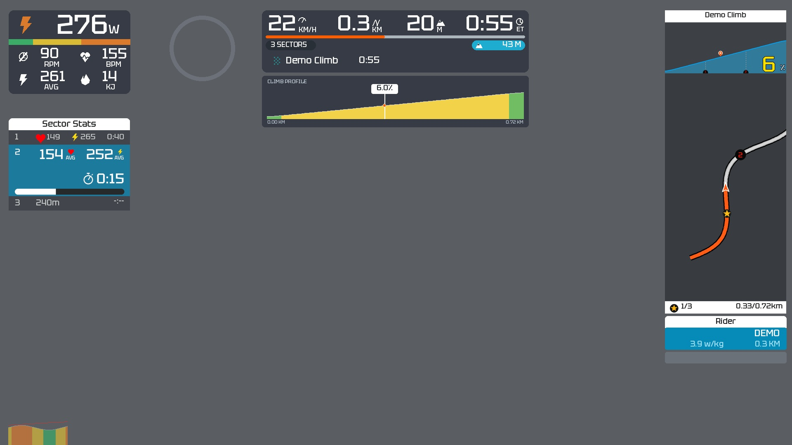

# 数据仪表盘 Skills 集合

这个仓库用于收集不同类型的数据仪表盘。每个仪表盘独立包含Skill、渲染脚本、视觉素材、数据说明和测试，可以按需安装，也可以直接运行脚本。

[English](README.md) · [添加新仪表盘](CONTRIBUTING.md)

## 仪表盘目录

| 仪表盘 | 用途 | 输出 | 文档 |
| --- | --- | --- | --- |
| **Zwift风格赛段HUD** | 骑行功率/心率、自定义分段、动态GPS地图及坡度 | 4K60透明MOV、PNG预览 | [使用说明](skills/zwift-segment-hud/README.zh-CN.md) · [Skill](skills/zwift-segment-hud/SKILL.md) |

目前已收录一个可运行的仪表盘。后续新增仪表盘放在`skills/`下的独立目录，目录表只列出已经实现的项目。



上图为骑行仪表盘示例，路线与传感器数据均为虚构，灰色只用于展示透明背景。

## 按需安装

```sh
git clone https://github.com/Just-blue/data-dashboard-skills.git
cd data-dashboard-skills
python3 scripts/install_skill.py --list
python3 scripts/install_skill.py zwift-segment-hud
```

默认安装到`${CODEX_HOME:-$HOME/.codex}/skills/<技能名>`；可用`--destination /目标/skills目录`指定位置。只复制选中的仪表盘，排除生成文件；已有同名目录时停止，不覆盖个人定制。安装器不会安装依赖或更改账号认证。

骑行HUD需要Python3.10+、FFmpeg及ffprobe。macOS可运行`brew install ffmpeg`，Ubuntu可运行`sudo apt-get install ffmpeg`。Python依赖：

```sh
python3 -m pip install -r skills/zwift-segment-hud/requirements.txt
```

如系统Python要求隔离环境，请先创建虚拟环境。然后在新对话中使用：

> 使用 $zwift-segment-hud，根据这个活动赛段生成4K60透明仪表盘：赛段成绩链接。

Strava链接不是渲染脚本的直接输入，活动获取、授权和赛段匹配仍需代理结合可用工具完成，具体要求见子目录文档。

## 直接运行

```sh
cd skills/zwift-segment-hud
python3 scripts/make_demo.py
python3 scripts/hud.py --config examples/demo/config.json \
  --output-dir outputs/preview --at 55 --width 1920
```

数据格式、视频导出和限制分别记录在各仪表盘文档中。现有骑行HUD使用1080p布局放大至4K，动效按60fps生成。

## 仓库结构

```text
skills/
  zwift-segment-hud/
    SKILL.md
    scripts/
    assets/
    references/
    tests/
    requirements.txt
scripts/install_skill.py
tests/
```

根目录负责集合索引和安装，不是一个单独的Skill。每个仪表盘独立管理依赖、字体许可和测试。

## 从旧版迁移

原先仓库根目录的骑行脚本已移到`skills/zwift-segment-hud/`。旧命令从该目录执行即可；原根目录的requirements.txt也已移入。已独立安装的本地Skill仍可使用。更新前先检查并备份本地修改，再替换对应技能目录，不要把整个集合装成一个Skill。

新增仪表盘按[贡献指南](CONTRIBUTING.md)添加。演示应使用虚构数据，个人运动记录、凭据和视频输出不进入Git。

代码与文档适用[MIT](LICENSE)，字体等第三方素材按各仪表盘中的声明分别授权，详见[素材说明索引](THIRD_PARTY_NOTICES.md)。
